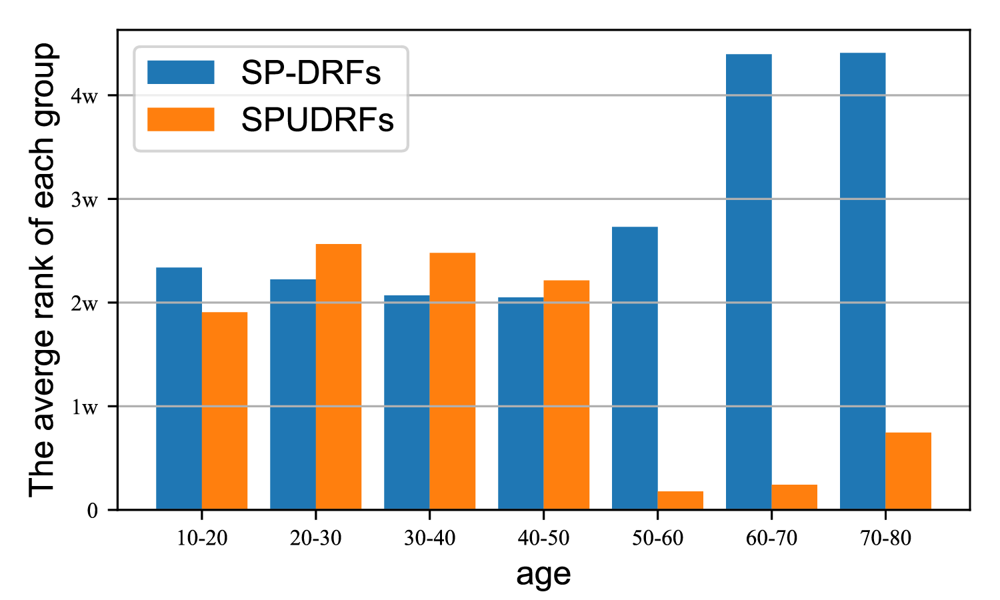
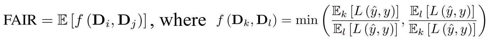

# Self-paced Deep Regression Forests with Consideration on Ranking Fairness


<div align=center>

</div>   

This is official codes for paper ***[Self-paced Deep Regression Forests with Consideration on Ranking Fairness](https://arxiv.org/abs/2112.06455).*** In this paper, we proposes a new self-paced paradigm for deep discriminative model, which distinguishes noisy and underrepresented examples according to the output likelihood and entropy associated with each example, and we tackle the fundamental ranking problem in SPL from a new perspective: **Fairness**.

## Why should we consider the fairness of self-paced learning?

We find that SPL focuses on easy samples at early pace and the underrepresented ones are always ranked at the end of the whole sequence. This phenomenon demonstrates the SPL has a potential sorting fairness issue. However, SPUDRFs considers sample uncertainty when ranking samples, thus making underrepresented samples be selected at early pace.

<div align=center>

</div>   

## Tasks and Performances

### **Age Estimation on MORPH II Dataset**

The gradual learning process of SP-DRFs and SPUDRFs. **Left:** The typical worst cases at each iteration.  **Right:** The MAEs of SP-DRFs and SPUDRFs at each pace descend gradually. Compared with SP-DRFs, the SPUDRFs show its superiority of taking predictive uncertainty into consideration.
<div align=center>

</div>   

### Gaze Estimation on MPII Dataset

The similar phenomena can be observed on MPII dataset. 
<div align=center>

</div>  

### **Head Pose Estimation on BIWI Dataset**

For visualization, we plot the leaf node distribution of SP-DRFs and SPUDRFs in gradual learning process. The means of leaf nodes of SP-DRFs **gather in a small range**, incurring seriously biased solutions, while that of SPUDRFs **distribute widely**, leading to much better MAE performance.
<div align=center>

</div>  

## Fairness Evaluation

We use FRIA, proposed in our paper, as fairness metric. FAIR is defined as following form.

<div align=center>

</div>  
<!-- <div align=center>

</div>    -->
The following table shows the FAIR of different methods on different datasets. SPUDRFs achieve the best performance on all datasets.
    
| Dataset |   MORPH   |   FGNET   |   BIWI    |  BU-3DFE  |   MPII    |
| :-----: | :-------: | :-------: | :-------: | :-------: | :-------: |
|  DRFs   |   0.46   |   0.42   |   0.46   |   0.740   |   0.67   |
| SP-DRFs |   0.44   |   0.37   |   0.43   |   0.72   |   0.67   |
| SPUDRFs | **0.48** | **0.42** | **0.70** | **0.76** | **0.69** |      
    
## How to train your SPUDRFs

### Pre-trained models and Dataset

We use pre-trained models for our training. You can download VGGFace from [here](https://www.robots.ox.ac.uk/~vgg/software/vgg_face/) and VGG IMDB-WIKI from [here](https://data.vision.ee.ethz.ch/cvl/rrothe/imdb-wiki/). 
The datasets used in our experiment are in following table. We use MTCNN to detect and align face. For BIWI, we use depth images. For MPII, we use normalized left eye and right eye patch as input, and details about normalization can be found [here](https://www.mpi-inf.mpg.de/departments/computer-vision-and-machine-learning/research/gaze-based-human-computer-interaction/appearance-based-gaze-estimation-in-the-wild).

| Task | Dataset |
| :-----: | :-------: |
| Age Estimation | [MOPRH](https://ebill.uncw.edu/C20231_ustores/web/store_main.jsp?STOREID=4) and [FG-NET](https://yanweifu.github.io/FG_NET_data/)|
| Head Estimation| [BIWI](https://icu.ee.ethz.ch/research/datsets.html) and [BU-3DFE](https://drive.google.com/file/d/1KrI37qUvaJgDnwlVb8vbluU9iV7QFtkc/view?usp=sharing)
| Gaze Estimation | [MPII](https://www.mpi-inf.mpg.de/departments/computer-vision-and-machine-learning/research/gaze-based-human-computer-interaction/appearance-based-gaze-estimation-in-the-wild)|

### Environment setup 

All codes are based on Pytorch, before you run this repo, please make sure that you have a pytorch envirment. You can install them using following command.

```
pip install -r requirements.txt
```
### Train SPUDRFs
#### **Code descritption:** 

Here is the description of the main codes.  
```
step.py:         train SPUDRFs from scratch  
train.py:        complete one pace training for a given train set
predict.py:      complete a test for a given test set
picksamples.py:  select samples for next pace   
```
<!-- We also provide a separate folder for [MPII](https://github.com/learninginvision/SPU/tree/master/MPII) datasets, because we use the pair of left eye patch and right eye patch, and additional head pose  as input, which requires a slight modification for the codes. You can use codes in MPII folder for experiments on MPII datasets. -->
#### **Train your SPUDRFs from scratch**:
You should download this repo, and prepare your datasets and pre-trained models, then just run following command to train your SPUDRFs from scratch.
- Clone this repo:
```
git clone https://github.com/learninginvision/SPUDRFs.git  
cd SPUDFRs  
```
- Set config.yml
```
lr: 0.00002
max_step: 80000
batchsize: 32

total_pace: 10
pace_percent: [0.5, 0.0556, 0.0556, 0.0556, 0.0556, 0.0556, 0.0556, 0.0556, 0.0556, 0.0552]
alpha: 2
threshold: -3.0
ent_pick_per: 0
capped: False
```
- Train from scratch
```
python step.py
```


## Acknowledgments

This code is inspired by [caffe-DRFs](https://github.com/shenwei1231/caffe-DeepRegressionForests).

