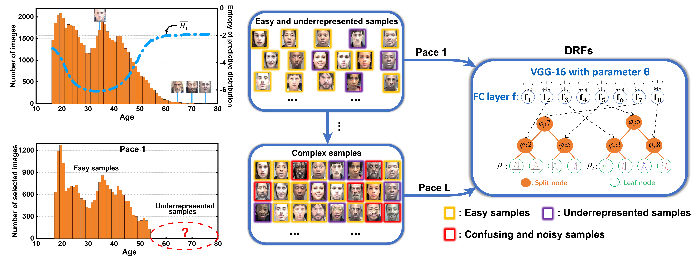
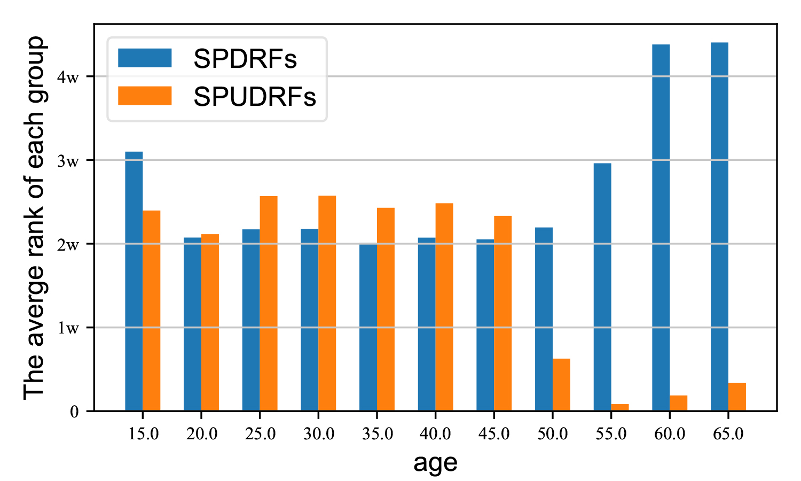
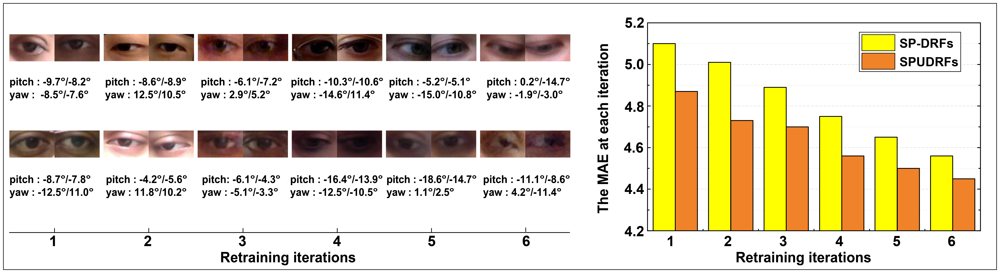
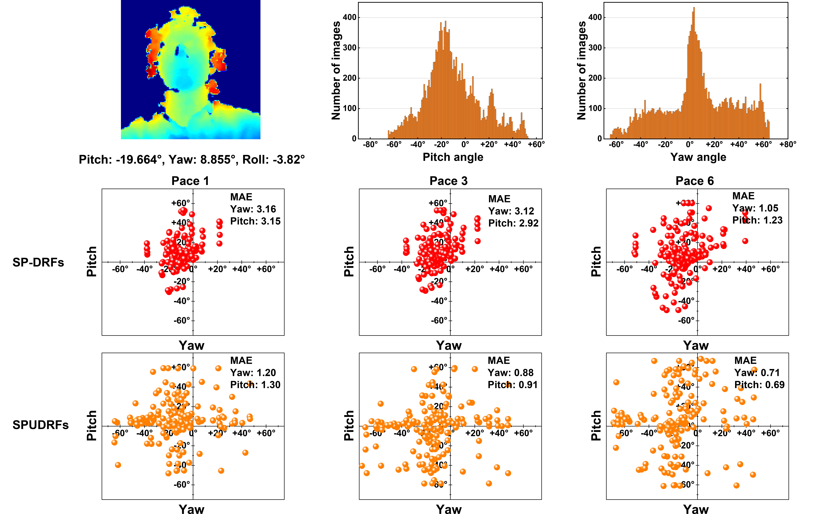
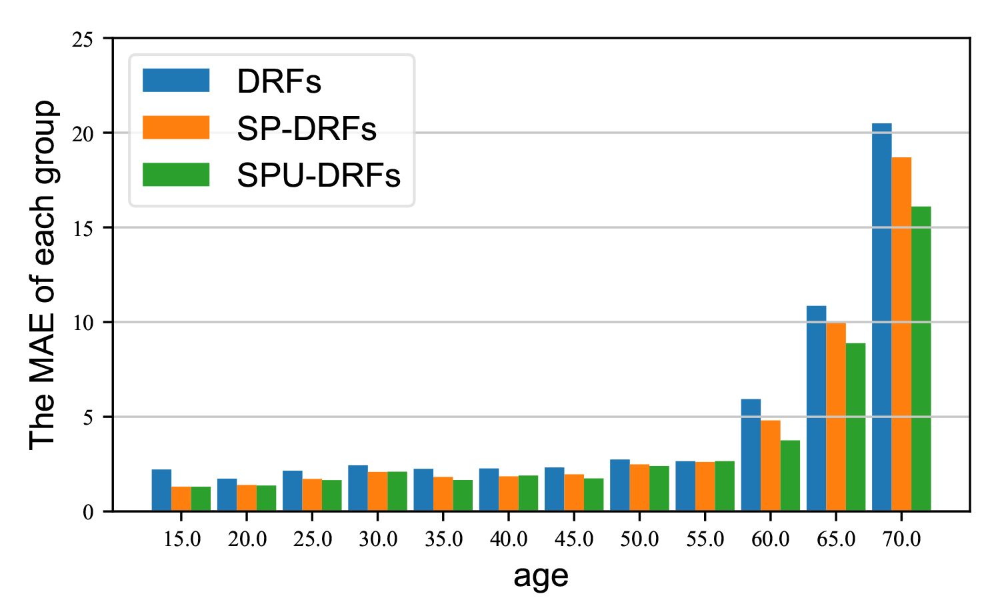
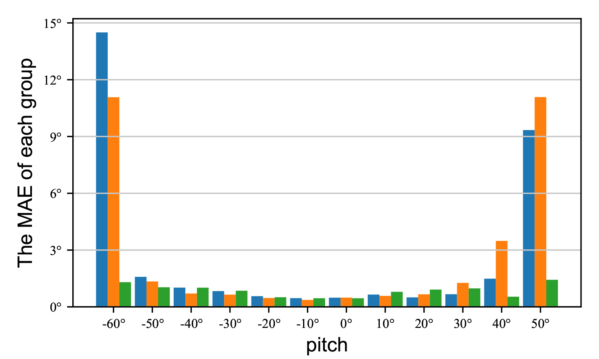

# Self-paced Deep Regression Forests with Consideration on Ranking Fairness


<div align=center>

</div>   
This is official codes for paper Self-paced Deep Regression Forests with Consideration on Ranking Fairness.

***Abstract:*** 

 

## Why should we consider the fairness of self-paced learning?

As we can see from the above figure, SPL focuses on easy samples and ignores underrepresented ones at early pace. The following figure gives more evidence on this phenomenon, which shows the average rank of difffierent age group of MORPH datasets. We find that the underrepresented samples are always ranked at the end of the whole sequence, which demonstrates the SPL has a potential sorting fairness issue. To tackle this problem, SPUDRFs are porposed, which considers sample uncertainty when ranking samples, thus making underrepresented samples be selected at early pace.

<div align=center>

</div>   

## Tasks and Performances

### **Age Estimation on MORPH II Dataset**

<div align=center>

</div>   


The gradual learning process of SP-DRFs and SPUDRFs. **Left:** The typical worst cases at each iteration. The two numbers below each image are the real age (left) and predicted age (right). **Right:** The MAEs of SP-DRFs and SPUDRFs at each pace descend gradually. The SPUDRFs show its superiority of taking predictive uncertainty into consideration, when compared with SP-DRFs.

### Gaze Estimation on MPII Dataset

<div align=center>

</div>  


The similar phenomena can be observed on MPII dataset. The MAE of SP-DRFs are inferior to that of SPUDRFs at each pace, which strongly demonstrates the defects of SP-DRFs.

### **Head Pose Estimation on BIWI Dataset**

<div align=center>

</div>  


The leaf node distribution of SP-DRFs and SPUDRFs in gradual learning process. Three paces, i.e. pace 1, 3, and 6, are randomly chosen for visualization. For SP-DRFs, the Gaussian means of leaf nodes (the red points in the second row) are concentrated in a small range, incurring seriously biased solutions. For SPUDRFs, the Gaussian means of leaf nodes (the orange points in the third row) distribute widely, leading to much better MAE performance.

## Fairness Evaluation

We use FRIA, proposed in our paper, as fairness metric. FAIR is defined as following form.

<div align=center>

</div>  
f(·) evaluate fairness between two subsets, FAIR is the expectation of fairness of any two groups. Here we show the MAE of different groups on MORPH and BIWI dataset. As we can see, both SP-DRFs and SPUDRFs can achieve better performance than DRFs in lower age range, while SPUDRFs is significantly better than the other two methods in higher age range. This shows our method alleviate the bias of underrepresented samples. 

<div align=center>

</div>   
The following table shows the FAIR of different methods on different datasets. SPUDRFs achieve the best performance on all datasets.
    
| Dataset |   MORPH   |   FGNET   |   BIWI    |  BU-3DFE  |   MPII    |
| :-----: | :-------: | :-------: | :-------: | :-------: | :-------: |
|  DRFs   |   0.581   |   0.471   |   0.462   |   0.740   |   0.668   |
| SP-DRFs |   0.559   |   0.465   |   0.429   |   0.718   |   0.674   |
| SPUDRFs | **0.608** | **0.474** | **0.702** | **0.756** | **0.686** |      
    
## How to train your SPUDRFs

### Pre-trained models and Dataset

We use pre-trained models for our training. You can download VGGFace from [here](https://www.robots.ox.ac.uk/~vgg/software/vgg_face/), where both caffemodel and torch model are provided.  VGG IMDB-WIKI pre-trained model can be download [here](https://data.vision.ee.ethz.ch/cvl/rrothe/imdb-wiki/), where only caffemodel is provided. 

We also provide our infomation about datasets we use in our experiment. We use [MOPRH](https://ebill.uncw.edu/C20231_ustores/web/store_main.jsp?STOREID=4) and [FG-NET](https://yanweifu.github.io/FG_NET_data/) for age estimation, [BIWI](https://icu.ee.ethz.ch/research/datsets.html) and [BU-3DFE](https://drive.google.com/file/d/1KrI37qUvaJgDnwlVb8vbluU9iV7QFtkc/view?usp=sharing) for head pose estimation, [MPII](https://www.mpi-inf.mpg.de/departments/computer-vision-and-machine-learning/research/gaze-based-human-computer-interaction/appearance-based-gaze-estimation-in-the-wild) for gaze estimation. We use MTCNN to detect and align face. For BIWI, we use depth images. For MPII, we use normalized left eye and right eye patch as input, and details about normalization can be found [here](https://www.mpi-inf.mpg.de/departments/computer-vision-and-machine-learning/research/gaze-based-human-computer-interaction/appearance-based-gaze-estimation-in-the-wild).

### Environment setup 

All codes are based on Pytorch, before you run this repo, please make sure that you have a pytorch envirment. You can install them using following command.

```
pip install -r requirements.txt
```

### Train SPUDRFs

#### **Code descritption:** 

Here is the description of the main codes.  

- **step.py:**   
  train SPUDRFs from scratch  
- **train.py:**   
  complete one pace training for a given train set
- **predict.py:**   
  complete a test for a given test set
- **picksamples.py:**   
  select samples for next pace   

We also provide a separate folder for [MPII](https://github.com/learninginvision/SPU/tree/master/MPII) datasets, because we use the pair of left eye patch and right eye patch, and additional head pose  as input, which requires a slight modification for the codes. You can use codes in MPII folder for experiments on MPII datasets.

#### **Train your SPUDRFs from scratch**:

You should download this repo, and prepare your datasets and pre-trained models, then just run following command to train your SPUDRFs from scratch.

```
git clone https://github.com/learninginvision/SPUDRFs.git  
cd SPUDFRs  
python step.py
```

## Acknowledgments

This code is inspired by [caffe-DRFs](https://github.com/shenwei1231/caffe-DeepRegressionForests).

